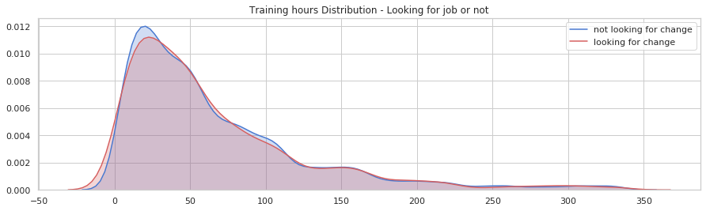
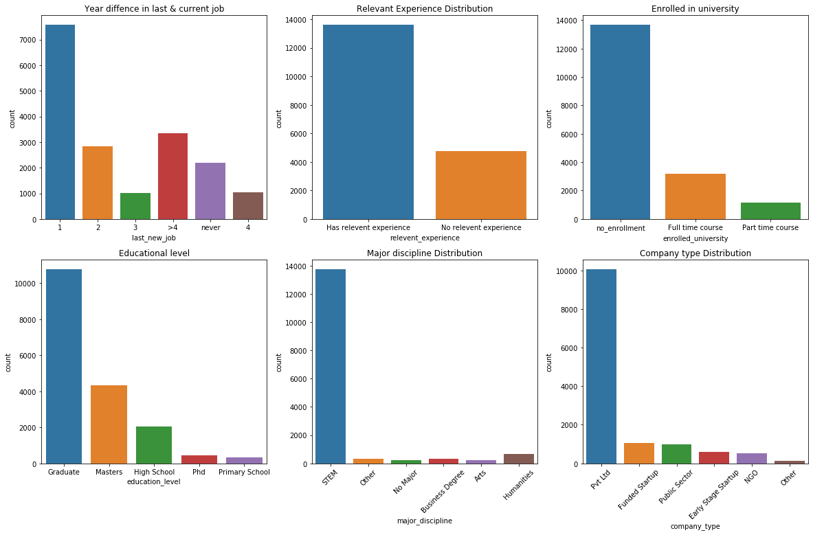
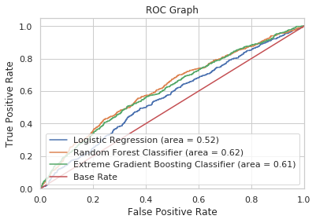
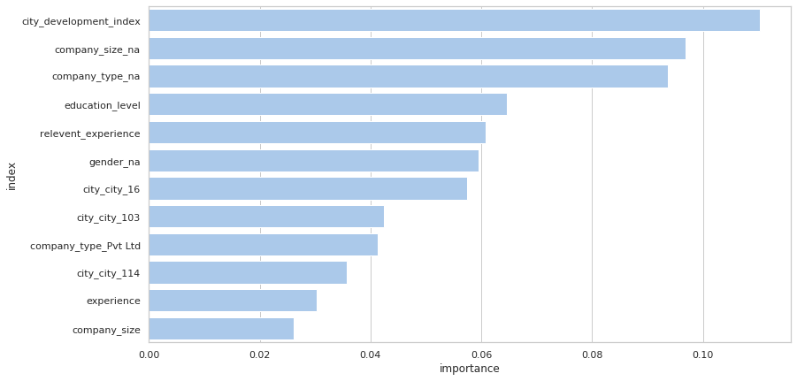

# AV-janatahack-HR-analytics

AnalyticsVidhya- Predict probability of an Enrollee's Job outlook 

[Problem Link](https://datahack.analyticsvidhya.com/contest/janatahack-hr-analytics/#ProblemStatement)

**NOTE: While developing the model, we have assumed that no test set is present. So all the analysis inclusing missing value treatment is based on training
**data provided. With this we were able to score 68.3% (AUC) vs top score of 69.4%.

# 1. DEFINE

#### Problem Statement

A training institute which conducts training for analytics/ data science wants to expand their business to manpower recruitment 
(data science only) as well. Company gets large number of signups for their trainings. Now, company wants to connect these enrollees with their clients who are looking to 
hire employees working in the same domain. Before that, it is important to know which of these candidates are really looking for a new employment. 
They have student information related to demographics, education, experience and features related to training as well.
To understand the factors that lead a person to look for a job change, the agency wants to design a model that uses the current 
credentials/demographics/experience to predict the probability of an enrollee to look for a new job.

#### Available Data

| Variable Type	| Variables |
| ------------- | ----------------- |
| Unique id	| Enrollee id |
| Demographic | City, city development index, gender |
| Education	| Educational level, major, university type|
| Experience | Total experience, analytics experience, company type and size | 
| Institute level | Training hours | 
| target | probability if enrollee is looking for a job|

# 2. DISCOVER

#### Exploratory Data Analysis

We observed that target (job outlook) is negatively correlated with city development index (not very high) because students coming from a metropolitan
city or the city with high development index who might already have a job (preferably in analytics) and enrolled in the course to gain more knowledge.

We see that no correlation between training hours and job outlook. We can confirm this from below distribution as well.

Analysis shows that most of the students have done under 100 hours of trainings and more than half of the students are from developed city with city 
development index greater than 0.9.

From the categorical variables we can infer that:
- Nearly 40% of the students recently changed the job i.e. within 1 year period. From this we can say that as industries are transforming more towards 
analytics, hence the employees are upskilling themselves to stay relevant in the new job by enrolling to this data science course provided by the institute. 
- 70% of the students have some sort of prior analytics experience before joining the course shows that higher level of analytics skills are necessary on the job. 
- Among the students who already has a job, majority are from private sectors indicating that private sectors are aggresively leveraging 
analytics to solve business problems and this skill is in demand in this sector. It may also indicate that their employees are being paid well for this 
kind of job in comparison with startup, public setors, hence higher level of enrollment coming from private sectors.
- Almost 90% of the students are from STEM background with very few uniformly distributed across other majors such as Arts, Humanities, Business etc. 
Among all the students, more than half have a gradudate degree and nearly 20% with a masters degree. 

#### Data Quality Check
There were missing values in some columns inclusing gender, company type and size, university major. As per observation, there were no unexpected 
values in the dataset. We will handle the missing values by replacing the numeric columns with median and categorical columns with mode of the data. Also
we will create one additional new column per the missing value columns to indicate if a row is missing in the original data or not. For e.g. if `gender`
column has missing values then we will impute the missing values with mode and will create `gender_na` which will have `true/false` value indicating if 
a row was missing from original data or not.

Next we will do the one-hot encoding of the categorical variables.

#### Treating Imbalance Classes

We have observed in the data that only 13% are in the minority class (looking for a job). As our model will have difficult time coping this type of data,
we will treat the minority classes.

First we will perform 4 resamplings and we will measure which sample perorm better in terms of some metric and then we will select the best sample.
- Orginal Sample
- Upsampling Data by adding duplicate rows of minority class
- Upsampling Data by using SMOTE)
- Downsampling Data (delete rows in majority class) 
**Resut:**
- Original Sample: F1 Score 1%
- Upsample: F1 Score 59%
- SMOTE: F1 Score 76%
- Downsample: F1 Score 59%

So we chose SMOTE sample to further do the modelling.

#### Evaluation Metric
Submissions are evaluated on Area under curve (AUC) between the predicted probability and observed category in the test set.

#### Hypothesize Solution
We will create a baseline model first and note the score. After that we will use tree classifiers and logistic regression to beat the baseline.
4 models
- Baseline model (Here we predict probability of each row as 0.13 as in the data set we have 13% of the students who are looking for a job)
- Logistic regression
- Randomforest
- XGBoost

# 3. DEVELOP

- Baseline model gave AUC of 50%
- Logistic regression gave AUC score of 52%.
- Randomforest (after parameter tuning) gave highest AUC of 62%
- XGBoost (5 fold cross validation) gave AUC of 61%

#### Feature importance

# DEPLOY

- We automated training pipeline.
- Automated the prediction pipeline on the new data set.

#### Conclusion & Recommendation

We want our machine learn model to capture as much of the minority class as possible (i.e students looking for job change). 
Our objective is to catch all of the highly probable students with such characteristics at the risk of flagging some low-probable students not 
looking for job change after the course ends. 

May be we can focus on high probable students who may be looking for employment and prepare them and match with right employer.

Group the incoming students in 3 categories:
- Not looking for change :Probability of job change less than 0.35
- Unsure category: probability of job change is between 0.35 and 0.85
- Highly likely to change job: probability of job change is above 0.85

Focus on highly likely students to train more to prepare for job interviews. Provide special services to these students such as mock interviews, 
additional doubt clarification classes, more rigorous projects related to client industries (with of course for a fee which will generate additional 
revenue with less resources being used).

Provide special separate classes (with different tution rate) to students with no prior analytics experience to make them job ready as these are the 
students mostly are looking for a job change.

Tie-up with private sector companies so that they can train their employees by sending to this institute with charging corporate rate to these students.
As private sectors are aggresively using emerging technologies, probably a marketing campaign can be done at these companies. 

